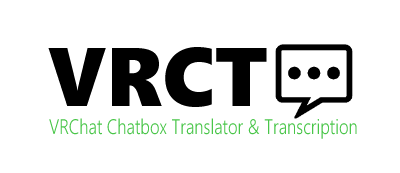
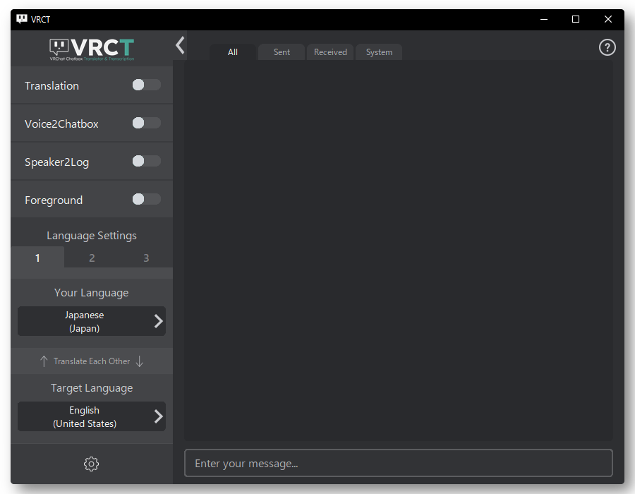

<div align="center">


[](https://github.com/misyaguziya/VRCT/releases)
[](https://github.com/misyaguziya/VRCT/releases)
[](https://github.com/misyaguziya/VRCT/blob/master/LICENSE)
[](https://misyaguziya.booth.pm/items/5155325)

| [English](./README.md) | **日本語** | [한국어](./README.kr.md) |

<h3>
VRCTは翻訳や文字起こしでVRChatの会話をサポートするソフトウェアです。
</h3>



<div align="left">

# ダウンロード＆インストール
好きな場所からダウンロードしてください。
- [Github.com](https://github.com/misyaguziya/VRCT/releases/)
- [BOOTH.pm](https://misyaguziya.booth.pm/items/5155325)

ダウンロードしてexeを起動するだけです。

# VRCTってなに？
VRCTは話す言語の異なる人同士が会話を行うためにチャットもしくは音声の翻訳を行うことで会話をサポートするソフトウェアです。  
これらの機能はVRChat内で使用するために設計されています。  
※サポート対象外ですがその他の用途として映画鑑賞等でも使用されています。

VRCTはあなたの会話を以下でサポートをします。
- 💬 **VRChatへのチャット送信機能**
- 🌐 **翻訳機能**
- 🎙 **マイクの文字起こし機能**
- 🔈 **スピーカーの文字起こし機能**

# ドキュメント
初期設定や基本機能、その他の機能についても記載してあります。  
- [Documents Link](https://mzsoftware.notion.site/VRCT-Documents-be79b7a165f64442ad8f326d86c22246?pvs=4)

# 使い方(Youtube)
<div align="center">

[](https://www.youtube.com/watch?v=rUTad037n8Q)

<div align="left">

# pythonで実行したい場合
1. 以下のバージョンのpythonをインストールしてください。  
    `python version 3.11.5`
2. packageのインストールとmain.pyを起動してください。  
    ```bash
    ./install.bat
    python main.py
    ```

## Author
- [みしゃ(misyaguzi)](https://github.com/misyaguziya) (メイン開発)
- [しいな(Shiina_12siy)](https://twitter.com/Shiina_12siy) (UI/UX, UI多言語対応)
- [レラ](https://github.com/soumt-r) (翻訳:韓国語)
- [どね](https://twitter.com/done_vrc) (ロゴデザイン)

---

VRCT は VRChat によって承認されておらず、VRChat または VRChat の開発もしくは管理に公式に関与する者の見解や意見が反映されたものではありません。VRChat および関連するすべての財産は 米国VRChat, Incの商標または登録商標です。