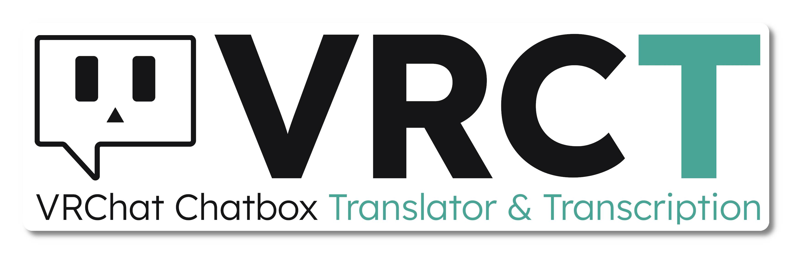
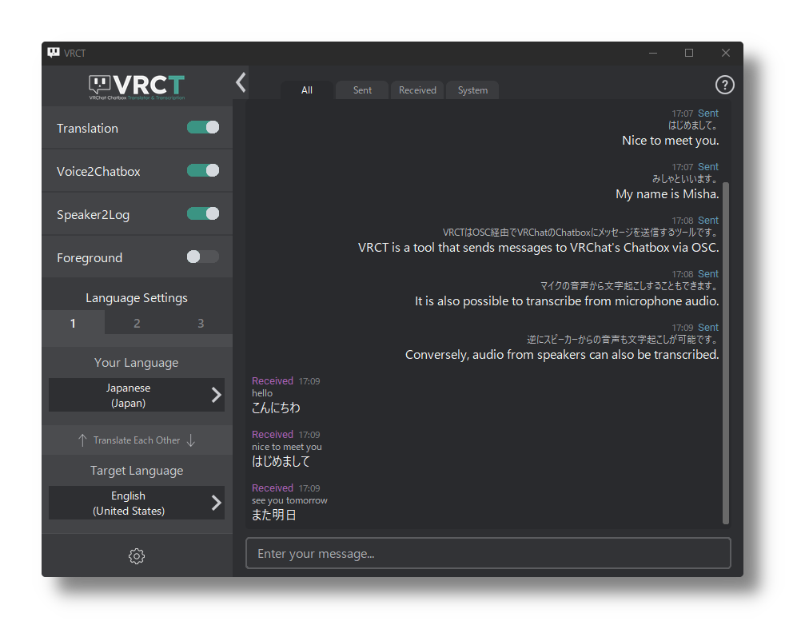

<picture>
    <source srcset="../img/vrct_logo_white.png" media="(prefers-color-scheme: dark)" width="50%">
    <source srcset="../img/vrct_logo_black.png" media="(prefers-color-scheme: light)" width="50%">
    
</picture>

 
 

<h3>
Become a VRCT Supporter on:
</h3>

<a href="https://vrct-dev.fanbox.cc">
    <picture>
        <source srcset="../img/pixiv_fanbox_white.png" media="(prefers-color-scheme: dark)" height="18px">
        <source srcset="../img/pixiv_fanbox_black.png" media="(prefers-color-scheme: light)" height="18px">
        
    </picture>
</a>&emsp;&nbsp;

<a href="https://patreon.com/vrct_dev">
    <picture>
        <source srcset="../img/patreon_logo_white.png" media="(prefers-color-scheme: dark)" height="22px">
        <source srcset="../img/patreon_logo_black.png" media="(prefers-color-scheme: light)" height="22px">
        
    </picture>
</a>&emsp;&nbsp;

<a href="https://ko-fi.com/vrct_dev">
    <picture>
        
    </picture>
</a>&emsp;&nbsp;

 

<picture>
    <source srcset="../img/supporter_section_border_d.png" media="(prefers-color-scheme: dark)">
    <source srcset="../img/supporter_section_border_l.png" media="(prefers-color-scheme: light)">
    
</picture>

 
 

| **English** | [日本語](./README.ja.md) | [한국어](./README.ko.md) | [繁體中文](./README.zh-Hant.md) |

<h3>
VRCT is software that supports VRChat conversations with translation and transcription.
</h3>

# Download & Install
Download from anywhere you like.
- [Github.com](https://github.com/misyaguziya/VRCT/releases/)
- [BOOTH.pm](https://misyaguziya.booth.pm/items/5155325)

Just download and run the exe.

# What is VRCT?
VRCT is software that supports conversations between people who speak different languages by providing chat or voice translation.
These features are designed for use within VRChat.
*Although not supported, it is also used for other purposes such as watching movies.

VRCT supports your conversations with
- 💬 **Send chat to VRChat**
- 🌐 **Translation**
- 🎙 **Transcription of audio from microphone**
- 🔈 **Transcription of audio from Speaker**

# Documents
Initial setup, basic functions, and other features are also described.
- [Documents Link](https://mzsoftware.notion.site/VRCT-Documents-be79b7a165f64442ad8f326d86c22246?pvs=4)

# How to Use (YouTube)

## Author
- [みしゃ(misyaguzi)](https://github.com/misyaguziya) (Main Development)
- [しいな(Shiina_12siy)](https://twitter.com/Shiina_12siy) (UI/UX, UI multilingual support)
- [レラ](https://github.com/soumt-r) (Technical Support)
- [どね](https://twitter.com/done_vrc) (Logo Design)

## Thanks to our contributors

---

VRCT is not endorsed by VRChat and does not reflect the views or opinions of VRChat or anyone officially involved in producing or managing VRChat properties. VRChat and all associated properties are trademarks or registered trademarks of VRChat Inc. VRChat © VRChat Inc.