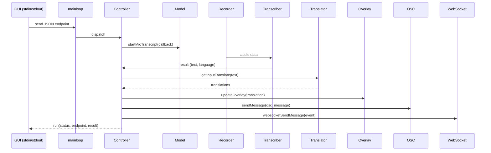

# システム図

以下はシステム構成の概要（Mermaid シーケンス図とテキスト版の両方）です。Mermaid がサポートされているビューアでは下のシーケンス図が描画されます。

## テキスト版（簡易）

Main process (`mainloop.py`)
  - stdin -> JSON コマンド -> Main.receiver -> queue
  - Main.handler -> Controller (コマンド実行)
  - run(status, endpoint, result) -> stdout (GUI に通知)

Controller
  - config (読み書き)
  - model (起動/停止/アクション)

Model サブシステム
  - device_manager (デバイス列挙/監視)
  - transcription (recorder -> transcriber)
  - translation (Translator)
  - overlay (OverlayImage -> Overlay)
  - osc (OSCHandler)
  - websocket (WebSocketServer)

データフロー（代表）: 録音 -> audio_queue -> AudioTranscriber -> Controller.micMessage -> Translator -> (OSC / Overlay / WebSocket / ログ)

