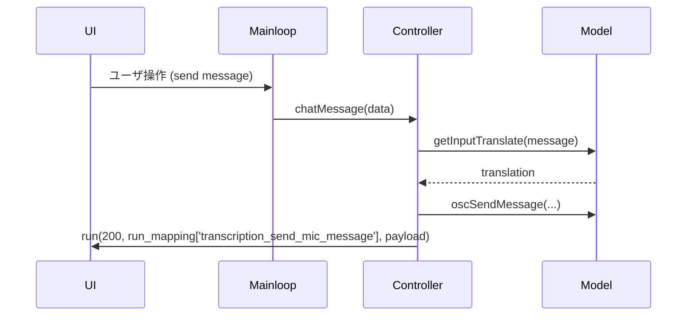

## Controller クラス仕様書

概要
- `Controller` はアプリケーションのコントロール層（Facade）で、`model` と `device_manager`、および外部 UI / mainloop とを仲介します。
- UI からのコマンドを受け取り、`model` の開始/停止、設定の変更、ダウンロードの開始、各種フラグの切り替え、進捗通知（`run` コールバック経由）を行います。
- 多くのメソッドは JSON 系の応答オブジェクトを返します: {"status": int, "result": Any}。副作用で `self.run(status, run_mapping[key], payload)` を呼び出して UI に通知します。

初期化とランタイムフック
- __init__() -> None
  - フィールド: `init_mapping: dict`, `run_mapping: dict`, `run: Callable`, `device_access_status: bool`
  - `setInitMapping(init_mapping: dict)` / `setRunMapping(run_mapping: dict)` / `setRun(run: Callable)` で mainloop からマッピング・コールバックを注入されることを想定。

コールバック通知用メソッド（UI への通知）
- connectedNetwork() / disconnectedNetwork() -> None
- enableAiModels() / disableAiModels() -> None
- updateMicHostList() / updateMicDeviceList() / updateSpeakerDeviceList() -> None
- updateConfigSettings() -> None
  - これらは `self.run(status, run_mapping[key], payload)` を使って UI にイベントを送ります。

ダウンロード用ヘルパークラス
- class DownloadCTranslate2(run_mapping: dict, weight_type: str, run: Callable)
  - progressBar(progress: float) -> None
  - downloaded() -> None
- class DownloadWhisper(run_mapping: dict, weight_type: str, run: Callable)
  - progressBar(progress: float) -> None
  - downloaded() -> None

音声・翻訳イベントハンドラ
- micMessage(result: dict) -> None
  - 引数: result: {"text": str|False, "language": str}
  - 挙動: ワードフィルタ、繰り返し検出、翻訳（`model.getInputTranslate`）、音声送信（OSC）・オーバーレイ更新・WebSocket ブロードキャスト等を行う。
  - エラー: 翻訳中に VRAM OOM が起きた場合は model.detectVRAMError を使って検出し、翻訳機能を無効化して UI に 400 を通知。

- speakerMessage(result: dict) -> None
  - 引数: result: {"text": str|False, "language": str}
  - micMessage と同様だが、受信（speaker）側のロジックやオーバーレイの扱いが異なる。

- chatMessage(data: dict) -> dict
  - 引数: {"id": Any, "message": str}
  - 戻り値: {"status": int, "result": {"id":..., "original":..., "translations":[...]}}
  - 挙動詳細:
    - 翻訳処理は `model.getInputTranslate` を呼び出します。翻訳処理中に VRAM 関連の例外が発生した場合、`model.detectVRAMError` によって検出し、翻訳機能を自動で無効化します。
    - VRAM エラー検出時は Controller は UI に対して 400 系の run イベントを発行する（例: `error_translation_chat_vram_overflow`, `enable_translation` で無効化通知）。
    - エラー発生時の戻り値: 翻訳を行わずに基本情報を含む 200 応答を返すコードパスがあり、クライアント側でのハンドリングを想定しています。

設定取得/変更系メソッド（代表例）
- getVersion() -> {"status":200, "result": config.VERSION}
- getComputeMode() / getComputeDeviceList() / getSelectedTranslationComputeDevice() -> dict
- setSelectedTranslationComputeDevice(device: str) -> {"status":200, "result": device}
- getSelectableCtranslate2WeightTypeDict() -> dict
- setEnableTranslation() / setDisableTranslation() -> dict
  - setEnableTranslation はモデルロード時に VRAM エラーを検知するロジックを内包している。
  - 多くの setXXX / getXXX メソッドは config を直接操作して即時反映する。

自動デバイス選択
- applyAutoMicSelect() / applyAutoSpeakerSelect()
  - `device_manager` にコールバックを登録して自動選択を有効化する。

トランスクリプション制御（スレッドで実行）
- startTranscriptionSendMessage() / stopTranscriptionSendMessage() / startThreadingTranscriptionSendMessage() / stopThreadingTranscriptionSendMessage()
- startTranscriptionReceiveMessage() / stopTranscriptionReceiveMessage() / startThreadingTranscriptionReceiveMessage() / stopThreadingTranscriptionReceiveMessage()
  - 実際の処理は `model.startMicTranscript` / `model.startSpeakerTranscript` に委譲される。VRAM エラーは検出して UI に通知し、自動的に停止する処理あり。

閾値・チェック系
- startCheckMicEnergy() / stopCheckMicEnergy() / startThreadingCheckMicEnergy() / stopThreadingCheckMicEnergy()
- startCheckSpeakerEnergy() / stopCheckSpeakerEnergy() / startThreadingCheckSpeakerEnergy() / stopThreadingCheckSpeakerEnergy()

ダウンロード開始（非同期/同期）
- downloadCtranslate2Weight(data: str, asynchronous: bool=True) -> dict
- downloadWhisperWeight(data: str, asynchronous: bool=True) -> dict
  - 非同期なら別スレッドでダウンロードを行い progressBar コールバックを経由して UI に進捗を返す。

Watchdog / WebSocket / OSC 周り
- startWatchdog() / feedWatchdog() / stopWatchdog()
- getWebSocketHost() / setWebSocketHost(data) -> dict
- setEnableWebSocketServer() / setDisableWebSocketServer()
- setOscIpAddress(data) / setOscPort(data)
  - ネットワーク周りの設定は検証ロジック（IP アドレス検証、サーバー利用可否のチェック）を含む。

ユーティリティ関数
- messageFormatter(format_type: str, translation: list, message: str) -> str
  - OSC に送る文面のフォーマットを生成（設定に基づく）。
- replaceExclamationsWithRandom(text) -> (str, dict)
- restoreText(escaped_text, escape_dict) -> str
- removeExclamations(text) -> str

重要な戻り値規約
- 成功: {"status": 200, "result": ...}
- 失敗: {"status": 400, "result": {"message": str, "data": Any}}
- 多くのメソッドは UI への通知として `self.run(status, run_mapping[key], payload)` を行う。

エッジケース / エラー処理
- VRAM OOM 検出: モデル例外が上がると model.detectVRAMError(e) を呼び出し、VRAM エラーが検出された場合は関連機能を自動で無効化して UI に 400 を通知する。
- デバイスアクセスの競合: `device_access_status` による簡易ロックで、デバイス操作中は待機する。
- ネットワーク依存: DeepL 等の外部翻訳 API 利用可否は `model.authenticationTranslatorDeepLAuthKey` で検査し、無効時は選択肢を更新する。

呼び出し例（Python から直接）
```python
from controller import Controller
ctrl = Controller()
# run コールバックの例: (status:int, event_name:str, payload:any)
def ui_run(status, event, payload):
    print(status, event, payload)

ctrl.setRun(ui_run)
resp = ctrl.setEnableTranslation()
print(resp)  # {'status':200, 'result': True}

data = {"id": 123, "message": "Hello"}
resp = ctrl.chatMessage(data)
print(resp)
```

シーケンス図（簡易: マイク入力 -> 翻訳 -> UI 通知）


次の作業
- `docs/api.md` を `mainloop.py` のマッピングに基づいて拡張し、各エンドポイントの request/response 例を追加してください。

参考: 実装詳細は `src-python/controller.py` を参照してください（メソッドごとに細かな条件分岐や run_mapping キーが存在します）。
# controller.py — 詳細設計

目的: UI（または外部プロセス）からの操作を受け、`config` と `model` を操作して副作用を生じさせるコマンド層。

主要クラス/関数:
- class Controller
  - 属性:
    - init_mapping: アプリ起動時の読み出し用マッピング（/get/data/*）
    - run_mapping: イベント通知先のエンドポイントマップ（run 関数で使用）
    - run: run(status, endpoint, result) を格納

  - 主要メソッド:
    - setEnableTranslation / setDisableTranslation: 翻訳機能の切替（モデル切替や VRAM エラー回復処理を含む）
    - start/stop transcription/energy checks: Model の startMicTranscript 等を呼ぶ
    - downloadCtranslate2Weight / downloadWhisperWeight: ダウンロードを非同期で開始し進捗を run 経由で通知
    - micMessage / speakerMessage / chatMessage: 認識結果を受け、翻訳/OSC/Overlay/WebSocket/ログ記録を行う主要ハンドラ
    - messageFormatter: OSC 用メッセージ整形
    - 多数の get/set 系関数: config の各種設定を読み書きし status/result を返す

エラー/例外:
- VRAM 関連は特に注意し、検出時は該当機能を無効化してユーザーへ通知する。

API マッピング:
- `mainloop.py` の `mapping` と連携しており、多くの `/get/data/*` `/set/data/*` `/run/*` が Controller のメソッドにマッピングされる（詳細は docs/api.md を参照）。

